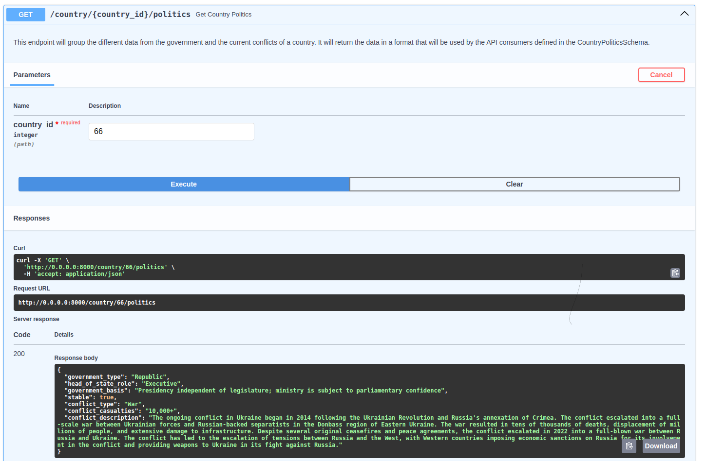

# World_glimpse

Hey there! Welcome to the repo of my final proyect of the Ironhack Data Analytics course in Madrid: World Glimpse.

World Glimpse is an api built-on project with a front-end to explore different aspects of world countries and regions to get an overall idea of their characteristics and current situation. Some aspects that are included are:

+ General: Main spoken langguages, demographic population, size.
+ Social: Well-being and social indicators, such as the poverty index or the sexism rating.
+ Political: Government system, on-going conflicts if existing, etc.
+ Economical: relative power adquisition indexes such as PPP, economic proportions.

A subsection of news for each country is also included, based on calls to the World News API.

# About the API:

The API built to feed the front-end was made with FastAPI. It is connected to a MySQL database by classes mapped to the tables through sqlalchemy.
The diverse end-points created are meant to provide specific information to the front, from the database and also from other APIs such as restcountries or World News API.
They are all described in comments along the code of the main.py file.

Here is an example of an end-point that gathers information from the database from two different tables for a specific country id; makes a query to the politics one for a summary of the governnment structure, and to the ongoing_conflicts one to obtain information about its peace status:

